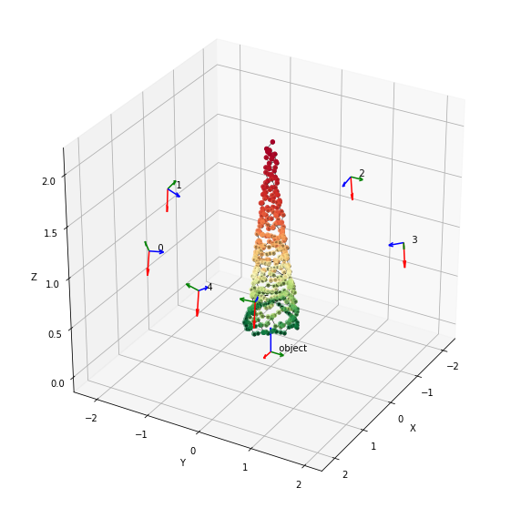
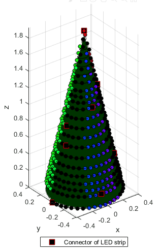

# xmas-lights

Animates a Christmas tree with colorfull geometric patterns.

 

## Calibration of Tree Bulb Positions

The 3D positions of the bulbs are calculated via a calibration step to blink the tree in a space-dependent pattern. This calibration involves recording multiple videos of the tree in different points of view. By blinking the bulbs in a known pattern, the position of each bulb can be triangulated.

Each bulb have a unique blinking pattern, allowing correspondence of the bulb among all the videos (A). Then the position of the bulbs, pose of the video-recording cameras, and the camera optical properties are calculated together via Bundle Adjustment (B, C). Finally, a reference frame is redefined at the base of the tree (D) for use by the tree blinking equations.

### A) Identifying Bulbs on Images (Correspondence)

Each bulb blinks in a unique pattern so that their corresponding image frame locations can be identified on any video. The pattern is a sequence of 6 colors, which could be red, green, or blue, and that when represented as a ternary number (red=0, green=1, blue=2), uniquely form numbers between 0 to `NUM_BULBS`-1.


See `model_tre/segment_lights_Color.ipynb` for source code.

### B) Calculating 3D Position of Bulbs (Bundle Adjustment Initialization)

1. Estimate camera pose displacement between two views (`cv2.findEssentialMatrix`, `cv2.recoverPose`)
2. Estimate 3D positions of bulbs visible in `i = 1, 2, .... N` and `j = 1, 2, ... N` such that `i != j`  (`cv2.triangulatePoints`)
3. Estimate camera pose of view `k = 1, 2, ... N` using correspondence between estimated 3D positions and observed 2D positions of bulbs (`cv2.solvePnP`)
4. Repeat steps 2 and 3 until results converge

### C) Refining 3D Position of Bulbs (Bundle Adjustment)

The results of step B can be improved by estimating the 3D position of bulbs, camera poses, and camera optical parameters simultaneously in a nonlinear optimization problem. The minized function is the reprojection error of the bulbs into the image frames. The step B initialization is necessary as an initial guess to the optimization problem.



### D) Reorienting Tree (Cone Fitting)

The blink pattern equations use the 3D position (x, y, z) of the bulbs. To simplify the equations, a new reference frame is positioned on the top of the tree, with z pointing up.

```
[x, y, z]^T = R^T @ (S - t)
z = - a * (x^2 + y^2)^0.5
```

where `S` is the original bulb position, `[x, y, z]^T` are transformed bulb positions, and unknown variables `R`, `t`, and `a` are SO(3) rotation, 3D translation, and ratio between height and radius of cone, respectively. These unknown variables are estimated via nonlinear optimization.

A static transformation can then translate the reference frame down to the base of the tree, and scale to within -127 to 127 units to fit in a `int8_t` variable. 

## Blinking Pattern

The tree color hue changes over time and along the angle parameter of the cylindrical coordinate. In addition, this color hue is "masked" by a geometrical pattern that periodically alternate in shape. See [animate_pattern.m](animate_pattern.m) for more details.



**Background Colors:**

The color of each bulb is defined by its Hue, Saturation, and Value (HSV). The Saturation and Value are kept at maximum while the Hue is a function of

`hue := 127 + 127 * sin(Kt*time + Kq*angle)`

where `Kt`, `Kq`, and `angle` are the time constant, angle constant, and angle parameter of the bulb in cylindrical coordinates. 

**Mask Pattern:**

For each bulb, the brightness state is defined as

`bright := sin(Kt*time + Kc*coord)`

Where `Kt`, `Kc`, and `coord` are the time constant, parameter constant, and coordinate of bulb. The bulb is off if `bright` is less than 0, otherwise it has the `hue` defined previously.

Different parameter constant and coordinates are used depending on the pattern type:

| Pattern | Function of parameter |
| ------- | ----------- |
| Radial  | Angle, cylindrical |
| Waterfall | Z |
| Circles | Radius, Y-axis cylindrical |
| Ray | Angle, Y-axis cylindrical | 

## Physical Implementation

**Materials:**

- 6 LED strips
- Microcontroller (ESP32 NodeMCU-32S)
- Power supply, 12V/6A and 5V (Computer supply, ATX)
- Christmas tree (1.9 m tall, 0.84 m diameter of base)

**Important Remarks:**

- Add a power connection (directly from the power supply) every 2 LED strips to avoid voltage drop along daisy-chain. Otherwise color hue is distorted (colors that needs more voltage are more affected).
- Mind the data wire end when connecting to the microcontroller. Use the ~~female~~ end.
- The microcontroller, the LED strips, and the power supply must all share the same ground voltage.
- Jump start the ATX power supply connecting green pin to ground (see [Instructables](https://www.instructables.com/id/How-to-power-up-an-ATX-Power-Supply-without-a-PC/))
- Newer implementation of the blinking pattern equations replace trigonometric functions and floating point math by modulo functions and integer math

**Software Challenges:**
- Arduino has low math processing capabilities. Use Teensy or ESP32 for higher update rates.
- Avoid calculation of bulb coordinates on Arduino. Use MATLAB to pre-calculate it and export to C++ code (see [map_bulbs.m](map_bulbs.m) and [print_coordinates.m](print_coordinates.m)).

